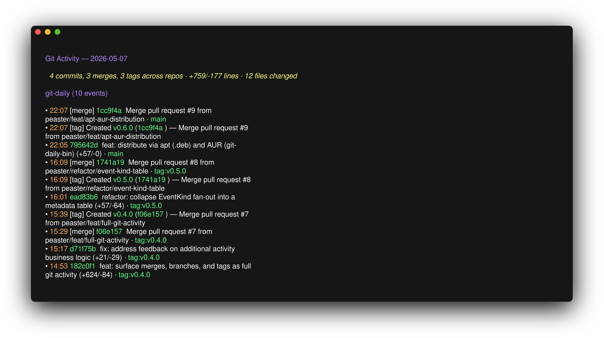

# git-daily

Extract your git activity across repos for a specific day. Outputs clean Markdown, designed as a helper for daily notes and standups.



## Install

**Homebrew:**

```bash
brew tap peaster/tap
brew install git-daily
```

**Debian/Ubuntu (.deb):**

```bash
curl -LO https://github.com/peaster/git-daily/releases/latest/download/git-daily_<version>_linux_amd64.deb
sudo dpkg -i git-daily_<version>_linux_amd64.deb
```

Replace `<version>` with the tag from [GitHub Releases](https://github.com/peaster/git-daily/releases). `linux_arm64.deb` is also published.

**Arch (AUR):**

```bash
yay -S git-daily-bin
# or: paru -S git-daily-bin
```

**Go:**

```bash
go install github.com/peaster/git-daily@latest
```

**Binary:** download from [GitHub Releases](https://github.com/peaster/git-daily/releases).

## Usage

```
git daily [OPTIONS] [DATE] [REPO_DIR...]
```

| Argument | Description |
|---|---|
| `DATE` | `today` (default), `yesterday`, or `YYYY-MM-DD` |
| `REPO_DIR` | Directories to search for git repos (default: `.`). Searched recursively up to 3 levels deep. |

**Options:**

- `-h`, `--help` — show help
- `-v`, `--version` — print version
- `--plain` / `--no-color` — output raw markdown even when stdout is a TTY
- `--style NAME` — Glamour theme: `dark`, `light`, `dracula`, `tokyo-night`, `pink`, `ascii`, `notty`, or path to a Glamour JSON style file

**Examples:**

```bash
git daily                              # today, repos under cwd
git daily yesterday                    # yesterday
git daily 2026-04-14 ~/projects        # specific day, specific directory
git daily today ~/work ~/oss           # multiple search roots
```

> [!TIP]
> Since the binary is named `git-daily`, git picks it up as a subcommand automatically — you can invoke it as `git daily` (shown above) and it shows up in git's tab completion. Invoking as `git-daily` works too.

## Configuration

Set `GIT_DAILY_AUTHORS` to match commits across multiple identities:

```bash
export GIT_DAILY_AUTHORS="peaster,paul@work.com,paul@home.com"
```

If unset, falls back to `git config user.name` and `user.email`.

`NO_COLOR` (any value) and `GLAMOUR_STYLE` are also honored. `NO_COLOR` forces raw markdown output; `GLAMOUR_STYLE` sets the default theme (overridden by `--style`).

## Terminal rendering

When stdout is a terminal, `git-daily` renders the markdown to ANSI-styled output with colored headings, hyperlinked commit hashes (OSC 8), and tinted inline code. When piped or redirected, raw markdown is emitted unchanged — so `git daily > today.md`, `ACTIVITY=$(git daily)`, and `git daily | pbcopy` keep working as before.

## Behavior

- Surfaces commits, merges, branches created, and tags created
- Searches all branches and tags (`--all`) for commits/merges
- Branches: detects creation via the branch's reflog (oldest entry)
- Tags: detects annotated tags via tagger date, lightweight tags via the underlying commit's date
- Reports source branch or tag for each commit; for new branches, reports the source they were created from
- Reports per-commit insertions/deletions and files changed
- Strict author filter: only includes events whose author/committer/tagger email matches `GIT_DAILY_AUTHORS` (or `git config user.email`/`user.name` fallback)
- Links each commit hash to the remote's web URL when a remote is configured (works across GitHub, GitLab, Gitea, Azure DevOps, …)
- Exits 0 on success (including no activity found), 1 on errors

## Building from source

```bash
make build        # build for current platform
make dist         # cross-compile for all platforms
make install      # install to $GOPATH/bin
```

## License

MIT
